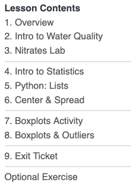
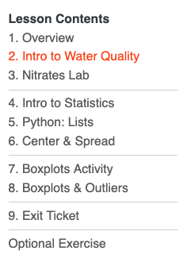
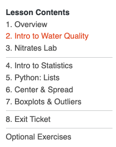
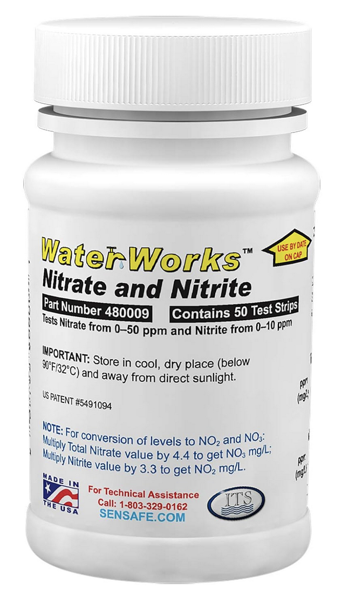
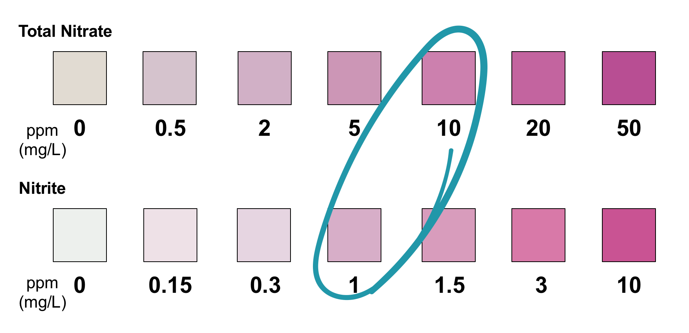
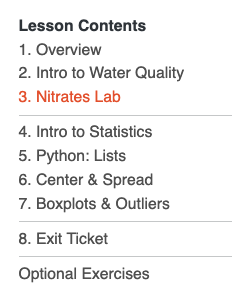
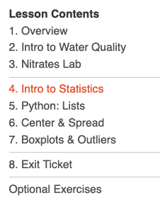
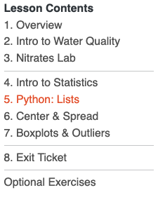
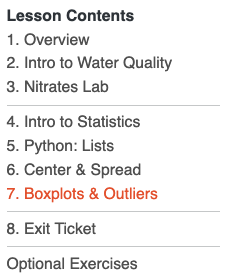

# Think about the water you drink. Where is it from? What do you know about it?

## Lesson Objective
<hr>
In this lesson, you will learn how to use the Python programming language to calculate summary statistics and investigate nitrates and nitrates in water samples.
<br>
<br>

:::notes
This lesson briefly touches on mean, median, range, and standard deviation. It assumes that students have seen these basic statistical concepts in the past and focuses on recalling them and using them in Python.
:::

:::{.gray-container .thirtyfourpt-font}
**Materials Needed:**  
- 💻 Your computer  
- A web browser (Chrome, Firefox, or Safari)  
- A calculator 
:::

# Workshop Structure

## Workshop Structure
<hr>

<br>
<br>

:::{.fourtyeightpt-font}
💻 **Navigate to:** [https://appalachianaicorps.org/](https://appalachianaicorps.org/) > Modules > Water Quality Monitoring > Lesson 1

<br>

**Note:** If you see a 💻 laptop 💻  icon in the slides, that means there is a corresponding activity in the module to complete!

:::notes
We suggest having the link available to students in the LMS or as a tinyURL. Appalachian can be difficult to spell!
:::
:::

## Workshop Structure
<hr>


:::{sixtypt-font}
**You move pages by clicking on this left-hand sidebar**
::: 



:::notes
This is the left-hand sidebar and how students will access different pages in the interactive module. Just click!
:::

<!-- ## Workshop Structure
<hr>
- Each page contains **checkpoints**. The checkpoints are linked at the top of the page and include code blocks to run and questions to answer.  
- They are numbered by the page they are on (number) and the order they are within each page (letter).
<br>
<br>

:::{.columns}
:::{.column}

:::
:::{.column}
:::{.ltblue-container .twentyfourpt-font}
**Checkpoints on this Page:**

- [**Checkpoint 2.a:** Role of Nitrogen](javascript:void(0))
- [**Checkpoint 2.b:** Nitrogen in Your Water](javascript:void(0))
- [**Checkpoint 2.c:** Nitrogen Summary](javascript:void(0))

:::
:::
::: -->


<!-- ## Workshop Structure
<hr>
The checkpoints will also be highlighted in the body of the module. When you come across one, that means there is something new to complete there!

:::{.ltblue-container .twentyfourpt-font}
🎯 **Checkpoint 2.a**: Role of Nitrogen
::: -->

# Let's Get Started! 🔬💧

## What is Python? 🐍
<hr>

:::{.fourtyeightpt-font}
- What do you know about programming?
- Have you heard of a programming language?
-  What do you think a programming language does?
:::

:::notes
The goal of this slide is to activate prior knowledge. What do students already know about computer science/Python? Importantly, our lessons assume no formal background.
:::

## 💻 Let’s Try Python Right Now!
<hr>
- Python will print text. In programming, we call text **strings**.

:::{.fragment}
:::{.ltblue-container .thirtyfourpt-font}
🎯 **Checkpoint 1.a**: Print Statements
:::
:::

:::{.fragment}

::: {.dkorange-container}
Click the ▶️ Run Code button to run the block.
:::

```python
# This is a comment - Python ignores lines that start with #
# Let's make Python print a message!

print("Hello, Water Scientist!")
```
<br>

**What happens?**
:::

## 💻 Let’s Try Python Right Now!
<hr>
- Python will print text. In programming, we call text **strings**.

:::{.ltblue-container .twentyfourpt-font}
🎯 **Checkpoint 1.a**: Print Statements
:::

::: {.dkorange-container}
Click the ▶️ Run Code button to run the block.
:::

```{python}
# This is a comment - Python ignores lines that start with #
# Let's make Python print a message!

print("Hello, Water Scientist!")
```

:::{.fragment}
**🎉 You just ran Python code!** The output is right below the block! See how it printed Hello, Water Scientist!

Note that strings are always surrounded by quotation marks.
:::

## 💻 Python Does Math!
<hr>
- Python can do math problems way faster than we can!

:::{.ltblue-container .twentyfourpt-font}
🎯 **Checkpoint 1.b**: Mathematical Operators
:::

:::{.dkorange-container}
Click the ▶️ Run Code button to run the blocks.
:::
➕ **Addition:**
```python
2 + 3
```

➖ **Subtraction:**
```python
3 - 2
```

✖️ **Multiplication:**
```python
2 * 3
```

➗ **Division:**
```python
3 / 2
```

:::notes
This is the one that doesn't render well.
:::


## 💻 Python Does Math!
<hr>

:::{.ltblue-container .twentyfourpt-font}
🎯 **Checkpoint 1.b**: Mathematical Operators
:::

:::{.dkorange-container}
Click the ▶️ Run Code button to run the blocks.
:::
➕ **Addition:**
```{python}
2 + 3
```

➖ **Subtraction:**
```{python}
3 - 2
```

## 💻 Python Does Math!
<hr>

:::{.ltblue-container .twentyfourpt-font}
🎯 **Checkpoint 1.b**: Mathematical Operators
:::

:::{.dkorange-container}
Click the ▶️ Run Code button to run the blocks.
:::

✖️ **Multiplication:**
```{python}
2 * 3
```

➗ **Division:**
```{python}
3 / 2
```


## 💻 Combining Math & Strings
<hr>
- You can combine strings and math!

:::{.ltblue-container .twentyfourpt-font}
🎯 **Checkpoint 1.d**: Print Statements with Math
:::

:::{.dkorange-container}
Click the ▶️ Run Code button to run the block.
:::

```python
print("2 + 3 =", 2 + 3)
```

:::{.fragment}
<br>
**Make a prediction.** What will Python print?
:::

:::{.fragment}
```{python}
print("2 + 3 =", 2 + 3)
```
:::

## 💻 Your Own Print Statements
<hr>
- Your turn! Edit the code in the block.

:::{.ltblue-container .twentyfourpt-font}
🎯 **Checkpoint 1.e**: Edit the print statements!
:::

:::{.dkorange-container}
- Change "Student" to your first name.

Click the ▶️ Run Code button to run the block.
:::

```python
# Change this message to your name!
print("My name is Student")

```
<!-- ##  💻 Intro to Water Quality
<hr>
Next Page 👉  
{width="40%"} -->

# Intro to Water Quality

## What is Water? 💧
<hr>

:::{.fragment}
- H<sub>2</sub>O is pure water!
    - But water is almost always mixed with other things:
        - minerals
        - salts
        - other chemicals
- Some of these things help water be safe to drink, while others make it unsafe.

:::

## Water Quality 💧
<hr>
<div style="position: relative; padding-bottom: 65%; height: 0; overflow: hidden;">
  <iframe 
    style="position: absolute; top: 0; left: 0; width: 100%; height: 100%;"
    src="https://edpuzzle.com/embed/media/695b558ffb53770c2e4fa1bd" 
    frameborder="0" 
    allowfullscreen>
  </iframe>
</div>

## Water Quality 💧
<hr>

:::{.fourtyeightpt-font}
- How do we learn about water quality?
- What questions do you have about water quality?
- Why do we collect data about water?
:::

## Water Quality 💧
<hr>

:::{.fourtyeightpt-font}
- **Nitrogen** can serve as both  a **nutrient** and a **pollutant**.
:::


## 🌳 Nitrogen as Nutrient
<hr>
- Nitrogen is naturally occurring.   
- When it combines with air and water, it forms ions: nitrates (NO<sub>3</sub>) and nitrites (NO<sub>2</sub>).
- Nitrogen within water is an important part of the nitrogen cycle, an important process necessary for life.

## 🌳 Nitrogen as Nutrient
<hr>

<div style="position: relative; padding-bottom: 65%; height: 0; overflow: hidden;">
  <iframe 
    style="position: absolute; top: 0; left: 0; width: 100%; height: 100%;"
    src="https://edpuzzle.com/embed/media/695c86636c7ddd288faebc26" 
    frameborder="0" 
    allowfullscreen>
  </iframe>
</div>

## 🌳 Nitrogen as Nutrient
<hr>

:::{.fourtyeightpt-font}
- Nitrogen is critical to life.
- As nitrogen cycles through the air and water, explain one way it is used by living organisms and how it is reintroduced into the cycle.
:::

## Nitrogen as Pollutant
<hr>
- Too much nitrogen in water can be a **pollutant**.   
- Excess nitrogen–in the form of nitrates and nitrites–can result from:
  - Agricultural operations (fertilizer runoff and livestock manure)
  - Sewage and septic systems (human waste)
  - Acid rain

## Nitrogen as Pollutant
<hr>

<div style="position: relative; padding-bottom: 65%; height: 0; overflow: hidden;">
  <iframe 
    style="position: absolute; top: 0; left: 0; width: 100%; height: 100%;"
    src="https://edpuzzle.com/embed/media/695c8e7d1b8b4b96f64b0e80" 
    frameborder="0" 
    allowfullscreen>
  </iframe>
</div>

## Nitrogen as Pollutant
<hr>

:::{.fourtyeightpt-font}
- This video shows excess fertilizer use can contribute to nitrogen as a pollutant in water.
- What other processes can you recall also contribute to nitrogen as a pollutant?
:::


## Monitoring Nitrogen: Your Utility 💧
<hr>
- The U.S. Environmental Protection Agency (EPA) sets limits on allowable concentrations of nitrates and nitrites in drinking water.

:::{.callout-important}
## Nitrate and Nitrite EPA Limits

**Nitrates:** 10 mg/L  
**Nitrites:** 1 mg/L
:::

:::{fourtyeightpt-font}
**🧠 Using [data from EWG](https://www.ewg.org/tapwater/), what is the most recently reported nitrate concentration by your water utility? Are your's over the limit?**  
:::


## Monitoring Nitrogen: YOU! 🔬💧
<hr>
- We can also monitor our own water for nitrogen!

:::{.columns}
:::{.column width = "33%"}
{width="90%"}
:::
:::{.column width = "67%"}

:::
:::

<!-- ##  💻 Nitrates Lab
<hr>
Next Page 👉  
{width="40%"} -->

# Nitrate Lab <br>🧑🏽‍🔬👨🏻‍🔬👩🏼‍🔬


## Nitrate Lab: Roles
<hr>
Assign roles to each person in your group:

:::{.columns}
:::{.column width = "50%"}
**Role 1:** *Data Recorder (Lab Report)*  

:::{.gray-container} 
- 1 lab handout  
- pencil
:::

<br>

**Role 2:** *Data Recorder (Computer)*  

:::{.gray-container} 
- computer (everyone else can put theirs away temporarily) 
- submission form pulled up in browser
:::
:::

:::{.column width = "50%"}
**Role 3:** *Lab Technician*  

:::{.gray-container}
- water samples
- test strips
:::
:::
:::

## Nitrate Lab: Procedure
<hr>
Read the procedure on your lab sheet. Make sure everyone in your group understands the procedure and has the materials needed for their role.
<br>
<br>
<br>

[🚀 **LET'S BEGIN** 🚀]{.sixtypt-font}

<br>
<br>
**When finished:** With the help of the *Data Recorder (Lab Report)*, make sure everyone in your group has a copy of the data table on their own sheet.

<!-- ##  💻 Intro to Statistics
<hr>
Next Page 👉  
{width="40%"} -->

# Intro to Statistics

## What is Statistics?
<hr>

:::{.fourtyeightpt-font}
- How can we make sense of the data we just collected during the nitrates lab?  
    - We can use statistics!  
- What do you know about statistics?
:::


## Measures of Center
<hr>
We use **measures of center** to find the central value of a group of numbers.
<br>

:::{.ltorange-container .center}
**Sample Dataset:**
 1, 2, 6, 5, 1
:::

### Mean
The *mean* is often called the "average".

:::{.ltorange-container .center}    
$\Large \frac{1 + 2 + 6 + 5 + 1}{5} = 3$
::: 
<br>
The mean value of this sample dataset is **3**.

## Measures of Center
<hr>
We use **measures of center** to find the central value of a group of numbers.
<br>

:::{.ltorange-container .center}
**Sample Dataset:**
 1, 2, 6, 5, 1
:::

### Median
The *median* is a different kind of measure of center.

:::{.ltorange-container}
$\large 1, 1, 2, 5, 6$  
{width="15%"}
:::

## Statistics: Your Turn
<hr>


:::{.ltblue-container .twentyfourpt-font}
🎯 **Checkpoint 4.a**: Calculations—Mean & Median
:::

Find the mean and median of your team's lab data:  
<br> 

[✏️]{.sixtypt-font} **Record your results on your lab sheet.**

<!-- ##  💻 Python: Lists
<hr>
Next Page 👉  
{width="40%"} -->

# 🐍 Python: Lists!

## 🐍 Python: Lists!
<hr>

:::{.ltorange-container .center}
**Sample Dataset:**
 1, 2, 6, 5, 1
:::

### Lists
In Python, we store multiple numbers in something called a **list**.

```{python}
# Our sample dataset from above 
# (the square brackets [ ] make it a list)

sample_data = [1, 2, 6, 5, 1]

print("Our sample data:", sample_data)
```


## 💻 Python: Make Your Own Lists!
<hr>

:::{.ltblue-container .twentyfourpt-font}
🎯 **Checkpoint 5.a**: Storing data as lists!
:::

:::{.dkorange-container}
Replace the `??`, `??`, `??`, and `??` placeholders with the nitrate and nitrite readings from your group!

Click the ▶️ Run Code button to run the block.
:::
```{python}
# Create a list of your group's nitrate and nitrite readings!
# Change the 10, 20, 30, 40 to your group's real values

group_nitrate = [10, 20, 30, 40]
group_nitrite = [10, 20, 30, 40]

print("My group's nitrate readings:", group_nitrate)
print("My group's nitrite readings:", group_nitrite)

```

## 💻 Python: Make Your Own Lists!
<hr>

:::{.ltblue-container .twentyfourpt-font}
🎯 **Checkpoint 5.b**: Basic functions with lists.
:::

#### len()
How many items are in a list?

```{python}
print("Number of samples tested:", len(group_nitrate))
```

#### min()
Smallest number in a list.

```{python}
print("Lowest nitrate:", min(group_nitrate))
```

#### max()
Biggest number in a list.

```{python}
print("Highest nitrate:", max(group_nitrate))
```

## 💻 Python: Make Your Own Lists!
<hr>

::: {.fragment}
:::{.ltorange-container .center}
**Sample Datasets:**
 A = [1, 2, 6, 5, 1]
:::

#### len()
How many items are in a list?

```python
print("Number of samples tested:", len(A))
```
:::

::: {.fragment}
Number of samples tested: 5
:::

::: {.fragment}

#### min()
Smallest number in a list.

```python
print("Lowest data point in A:", min(A))
```
:::

::: {.fragment}
Lowest nitrate: 1
:::

## 💻 Python: Make Your Own Lists!
<hr>

:::{.ltorange-container .center}
**Sample Datasets:**
 A = [1, 2, 6, 5, 1]
:::

::: {.fragment}
#### max()
Biggest number in a list.

```python
print("Highest data point in A:", max(A))
```
:::

::: {.fragment}
Highest nitrate: 6
:::


# Center & Spread

## Python: Measures of Center
<hr>
- We can also use Python to calculate measures of center.

#### Mean

```{python}
#| include: false
def mean(values):
    return sum(values) / len(values)

def median(values):
    sorted_values = sorted(values)
    n = len(sorted_values)
    mid = n // 2
    if n % 2 == 0:
        return (sorted_values[mid - 1] + sorted_values[mid]) / 2
    else:
        return sorted_values[mid]

def stdev(values):
    m = mean(values)
    variance = sum((x - m) ** 2 for x in values) / len(values)
    return round(variance ** 0.5, 1)
```

```{python}
# Same sample dataset
sample_data = [1, 2, 6, 5, 1]

# Calculate mean the easy way!
mean_sample = mean(sample_data)

print("mean of sample data:", mean_sample)
```

## 💻 Python: Measures of Center
<hr>

#### Mean: Your Turn!
:::{.ltblue-container .twentyfourpt-font}
🎯 **Checkpoint 6.a**: Calculating group mean nitrate.
:::

:::{.dkorange-container}
Replace the 10, 20, 30, and 40 placeholders with the nitrate readings from your group!

Click the ▶️ Run Code button to run the block.
:::

```{python}
# Recreate the list of your group's nitrate readings below

group_nitrate = [10, 20, 30, 40]

mean_nitrate = mean(group_nitrate)
```

On average, do you think your water is safe in terms of nitrate and nitrite concentrations? Why or why not?

## Class Data
<hr>
* Python can handle large amounts of data with ease!
* We can consider the nitrate and nitrite data your whole class collected.
* To do that, paste the .csv link from your teacher in the code to import the Google Form data.

:::{.callout-important}
## Your teacher will provide the link to the CSV file for you to use.
:::

## 💻 Class Data
<hr>

:::{.ltblue-container .twentyfourpt-font}
🎯 **Checkpoint 6.b**: Import class data.
:::

:::{.dkorange-container}
Replace the placeholder (Line 4) with CSV URL from your teacher. Be sure the keep the quotation marks! This will pull the class nitrate and nitrite data from the CSV file so you can use it later down the page.

Click the ▶️ Run Code button to run the block.
:::

```{python}
#| include: false
import requests
import csv
from io import StringIO

def load_class_data(csv_url):
    response = requests.get(csv_url)
    reader = csv.reader(StringIO(response.text))
    next(reader)  # Skip header
    rows = list(reader)
    
    class_nitrate = [float(row[3]) for row in rows]
    class_nitrite = [float(row[4]) for row in rows]
    
    return class_nitrate, class_nitrite
```

```python
# Replace the url with the one provided from your teacher. 
# Make sure to keep the quotation marks!

csv_url = "replace_this_with_your_csv_url"

class_nitrate, class_nitrite = load_class_data(csv_url)
```
```{python}
#| include: false
# Replace the url with the one provided from your teacher. 
# Make sure to keep the quotation marks!

csv_url = "https://docs.google.com/spreadsheets/d/e/2PACX-1vQcExgyfklx3OXtLbqLraE8lPanQNMmRNrNImbrtXGnns5wXit662-pUBr9TCtJW-k4ZpVUjxcGi9-c/pub?gid=441747576&single=true&output=csv"

class_nitrate, class_nitrite = load_class_data(csv_url)
```

## 💻 Class Data
```{python}
print("Nitrate values:", class_nitrate)
print("Nitrite values:", class_nitrite)
```
## 💻 Class Data: Mean
<hr>

:::{.ltblue-container .twentyfourpt-font}
🎯 **Checkpoint 6.c**: Calculate means for class data.
:::

:::{.dkorange-container}
Replace the `???` placeholders (Lines 3 & 4) with the variables that hold the class nitrate and nitrite data. That is, `class_nitrate` and `class_nitrite`, respectively.

Click the ▶️ Run Code button to run the block.
:::

```python
# Calculate mean nitrate and nitrite for class data (replace the ???)

mean_nitrate = mean(???)
mean_nitrite = (???)


```

## 💻 Class Data: Mean
<hr>

:::{.ltblue-container .twentyfourpt-font}
🎯 **Checkpoint 6.c**: Calculate means for class data.
:::

:::{.dkorange-container}
Replace the `???` placeholders (Lines 3 & 4) with the variables that hold the class nitrate and nitrite data. That is, `class_nitrate` and `class_nitrite`, respectively.

Click the ▶️ Run Code button to run the block.
:::

```{python}
# Calculate mean nitrate and nitrite for class data (replace the ???)

mean_nitrate = mean(class_nitrate)
mean_nitrite = mean(class_nitrite)

print(mean_nitrate)
print(mean_nitrite)

```


**Your answers will differ. This is example data.**

## 💻 Class Data: Median
<hr>

:::{.ltblue-container .twentyfourpt-font}
🎯 **Checkpoint 6.d**: Calculate medians for class data.
:::

:::{.dkorange-container}
Similarly, replace ??? with the correct variable names to calculate the median for the class nitrate and nitrite data.

Click the ▶️ Run Code button to run the block.
:::

```python
# Calculate median nitrate and nitrite for class data (replace the ???)

median_nitrate = median(???)
median_nitrite = median(???)

```

## 💻 Class Data: Median
<hr>

:::{.ltblue-container .twentyfourpt-font}
🎯 **Checkpoint 6.d**: Calculate medians for class data.
:::

:::{.dkorange-container}
Similarly, replace ??? with the correct variable names to calculate the median for the class nitrate and nitrite data.

Click the ▶️ Run Code button to run the block.
:::

```{python}
# Calculate median nitrate and nitrite for class data (replace the ???)

median_nitrate = median(class_nitrate)
median_nitrite = median(class_nitrite)

print(median_nitrate)
print(median_nitrite)

```

**Your answers will differ. This is example data.**

## Python: Measures of Spread
<hr>
- Spread is a second type of statistical measure.
- Like it sounds, it tells us how spread out our data are.

#### Range

:::{.ltorange-container}
**max()** - **min()**
:::

```{python}
# Same sample dataset
sample_data = [1, 2, 6, 5, 1]

max(sample_data) - min(sample_data)
```

## 💻 Class Data: Range
<hr>

#### Range: Your Turn!

:::{.ltblue-container .twentyfourpt-font}
🎯 **Checkpoint 6.e**: Calculate ranges for class data.
:::
:::{.dkorange-container}
Replace `???` with the correct variable names to calculate the ranges of the data.

Click the ▶️ Run Code button to run the block.
:::

```python
nitrate_range = max(???) - min(???)
nitrite_range = max(???) - min(???)
```

## 💻 Class Data: Range
<hr>

#### Range: Your Turn!

:::{.ltblue-container .twentyfourpt-font}
🎯 **Checkpoint 6.e**: Calculate ranges for class data.
:::
:::{.dkorange-container}
Replace `???` with the correct variable names to calculate the ranges of the data.

Click the ▶️ Run Code button to run the block.
:::

```{python}
nitrate_range = max(class_nitrate) - min(class_nitrate)
nitrite_range = max(class_nitrite) - min(class_nitrite)

print(nitrate_range)
print(nitrite_range)

```
**Your answers will differ. This is example data.**

## Class Data: Standard Deviation
<hr>

#### Standard Deviation
- The standard deviation is another measure of spread.
- It tell us the average distance the data in the dataset is from the mean.

```{python}
# Same sample dataset
sample_data = [1, 2, 6, 5, 1]

stdev(sample_data)
```

## 💻 Class Data: Standard Deviation
<hr>

#### Standard Deviation: Your Turn!

:::{.ltblue-container .twentyfourpt-font}
🎯 **Checkpoint 6.f**: Calculate standard deviations for class data.
:::
:::{.dkorange-container}
Replace `???` with the correct variable names to calculate the standard deviations of the data.

Click the ▶️ Run Code button to run the block.
:::

```python
nitrite_stdev = stdev(???)
nitrate_stdev = stdev(???)
```

## 💻 Class Data: Standard Deviation
<hr>

#### Standard Deviation: Your Turn!

:::{.ltblue-container .twentyfourpt-font}
🎯 **Checkpoint 6.f**: Calculate standard deviations for class data.
:::
:::{.dkorange-container}
Replace `???` with the correct variable names to calculate the standard deviations of the data.

Click the ▶️ Run Code button to run the block.
:::

```{python}
nitrate_stdev = stdev(class_nitrate)
nitrite_stdev = stdev(class_nitrite)

print(nitrate_stdev)
print(nitrite_stdev)
```

**Your answers will differ. This is example data.**


<!-- ##  💻 Boxplots & Outliers
<hr>
Next Page 👉  
{width="40%"} -->


# Boxplots & Outliers

## 💻 Class Data
<hr>
Whew! That was a lot of work. Wouldn't it be great if Python could do it for us? Good news. It can! But first, let's re-import our data on this page.  

:::{.ltblue-container .twentyfourpt-font}
🎯 **Checkpoint 8.a**: Import Class Data.
:::

:::{.dkorange-container}
Once more, replace the placeholder (Line 4) with CSV URL from your teacher. Be sure the keep the quotation marks! This will pull the class nitrate and nitrite data from the CSV file so you can use it later down the page.

Click the ▶️ Run Code button to run the block.
:::

```python
# Replace the url with the one provided from your teacher. 
# Make sure to keep the quotation marks!

csv_url = "replace_this_with_your_csv_url"

class_nitrate, class_nitrite = load_class_data(csv_url)
```


## 💻 Class Data: Boxplots
<hr>

:::{.ltblue-container .twentyfourpt-font}
🎯 **Checkpoint 8.b**: Create a boxplot for the class nitrate data.
:::

:::{.dkorange-container}
Click the ▶️ Run Code button to run the block and create a boxplot for the class nitrate data.
:::


```python
import matplotlib.pyplot as plt

plt.figure(figsize=(6, 6))
plt.boxplot(class_nitrate, vert=True, patch_artist=True,
            boxprops=dict(facecolor='plum'))
plt.ylabel('Nitrate (mg/L)', fontsize=12)
plt.xticks([])
plt.title('Boxplot of Class Nitrate', fontsize=13)
plt.grid(True, alpha=0.3, axis='y')
plt.show()
```

## 💻 Class Data: Boxplots
<hr>

:::{.ltblue-container .twentyfourpt-font}
🎯 **Checkpoint 8.b**: Create a boxplot for the class nitrate data.
:::

:::{.dkorange-container}
Click the ▶️ Run Code button to run the block and create a boxplot for the class nitrate data.
:::

:::{.columns}
:::{.column}
```python
import matplotlib.pyplot as plt

plt.figure(figsize=(6, 6))
plt.boxplot(class_nitrate, vert=True, patch_artist=True,
            boxprops=dict(facecolor='plum'))
plt.ylabel('Nitrate (mg/L)', fontsize=12)
plt.xticks([])
plt.title('Boxplot of Class Nitrate', fontsize=13)
plt.grid(True, alpha=0.3, axis='y')
plt.show()
```
<br>

**This uses example data.**
:::
:::{.column}
```{python}
#| echo: false
import matplotlib.pyplot as plt

plt.figure(figsize=(6, 6))
plt.boxplot(class_nitrate, vert=True, patch_artist=True,
            boxprops=dict(facecolor='plum'))
plt.ylabel('Nitrate (mg/L)', fontsize=12)
plt.xticks([])
plt.title('Boxplot of Class Nitrate', fontsize=13)
plt.grid(True, alpha=0.3, axis='y')
plt.subplots_adjust(bottom=0.3)
plt.show()
```
:::
:::

## 💻 Class Data: Boxplots
<hr>

Now, let's create a boxplot for the class nitrite data.

:::{.ltblue-container .twentyfourpt-font}
🎯 **Checkpoint 8.c**: Create a boxplot for the class nitrite data.
:::

:::{.dkorange-container}
Click the ▶️ Run Code button to run the block and create a boxplot for the class nitrite data.
:::

```python
plt.figure(figsize=(6, 6))
plt.boxplot(class_nitrite, vert=True, patch_artist=True,
            boxprops=dict(facecolor='lemonchiffon'))
plt.ylabel('Nitrite (mg/L)', fontsize=12)
plt.xticks([])
plt.title('Boxplot of Class Nitrite', fontsize=13)
plt.grid(True, alpha=0.3, axis='y')
plt.show()
```

## 💻 Class Data: Boxplots
<hr>

Now, let's create a boxplot for the class nitrite data.

:::{.ltblue-container .twentyfourpt-font}
🎯 **Checkpoint 8.c**: Create a boxplot for the class nitrite data.
:::

:::{.dkorange-container}
Click the ▶️ Run Code button to run the block and create a boxplot for the class nitrite data.
:::

:::{.columns}
:::{.column}
```python
plt.figure(figsize=(6, 6))
plt.boxplot(class_nitrite, vert=True, patch_artist=True,
            boxprops=dict(facecolor='lemonchiffon'))
plt.ylabel('Nitrite (mg/L)', fontsize=12)
plt.xticks([])
plt.title('Boxplot of Class Nitrite', fontsize=13)
plt.grid(True, alpha=0.3, axis='y')
plt.show()
```
<br>

**This uses example data.**
:::
:::{.column}
```{python}
#| echo: false
plt.figure(figsize=(6, 6))
plt.boxplot(class_nitrite, vert=True, patch_artist=True,
            boxprops=dict(facecolor='lemonchiffon'))
plt.ylabel('Nitrite (mg/L)', fontsize=12)
plt.xticks([])
plt.title('Boxplot of Class Nitrite', fontsize=13)
plt.grid(True, alpha=0.3, axis='y')
plt.subplots_adjust(bottom=0.3)
plt.show()
```
:::
:::

## Outliers
<hr>
**Outliers** are data points that are very different from the rest of your data.  
- Can really change your statistics—like mean and standard deviation.  
- On boxplots, outliers are represented by a circle (or sometimes a star) beyond the whiskers.  
<br>
<br>
<br>
🧠 **Do either the class nitrate or nitrite boxplot have outliers? How do you know?**

## Why Do Outliers Happen?
<hr>
Outliers can happen for different reasons:

:::incremental
1. **Buoy Malfunction** 🔧  
2. **Real Pollution Event** 🚨  
    - Factory dumped chemicals into the stream
    - Farm fertilizer washed in after a storm
    - Sewage spill
3. **Natural Event** 🌧️  
    - Heavy rain changed water chemistry  
    - Algae bloom  
    - Seasonal variation  
:::

:::{.fragment}
**Your job as a scientist:** Figure out which reason it is!
:::

# 🎟️<br>Exit Ticket

## 🎟️ Exit Ticket
<hr>
<br>
<br>
<br>
<center>
[🎉 Great job! You've learned so much!<br>Share what you've learned on the [**Exit Ticket**](https://forms.gle/k4P6FK6BpnusNMyZ9).]{.thirtyfourpt-font}
</center>

# 🧠<br>Exercises

## 🧠  Exercises
<hr>
<br>
<br>
<br>
<center>
[Want to practice what we've learned?<br>Try the [**Exercises**](https://colab.research.google.com/drive/1xm5qwxA6ZCm3BxuTKFL6n1ItlWgR84jM?usp=sharing).]{.thirtyfourpt-font}
</center>