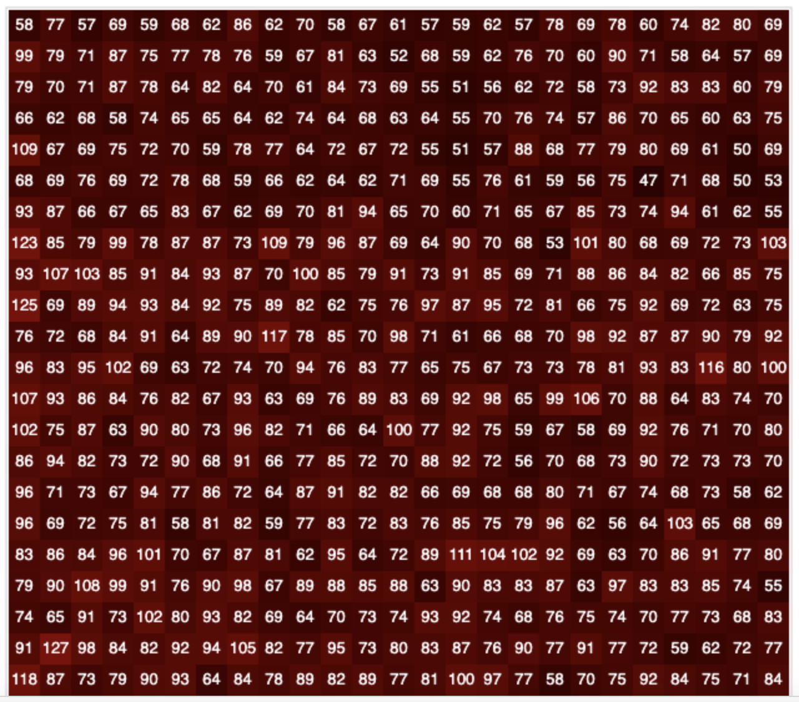
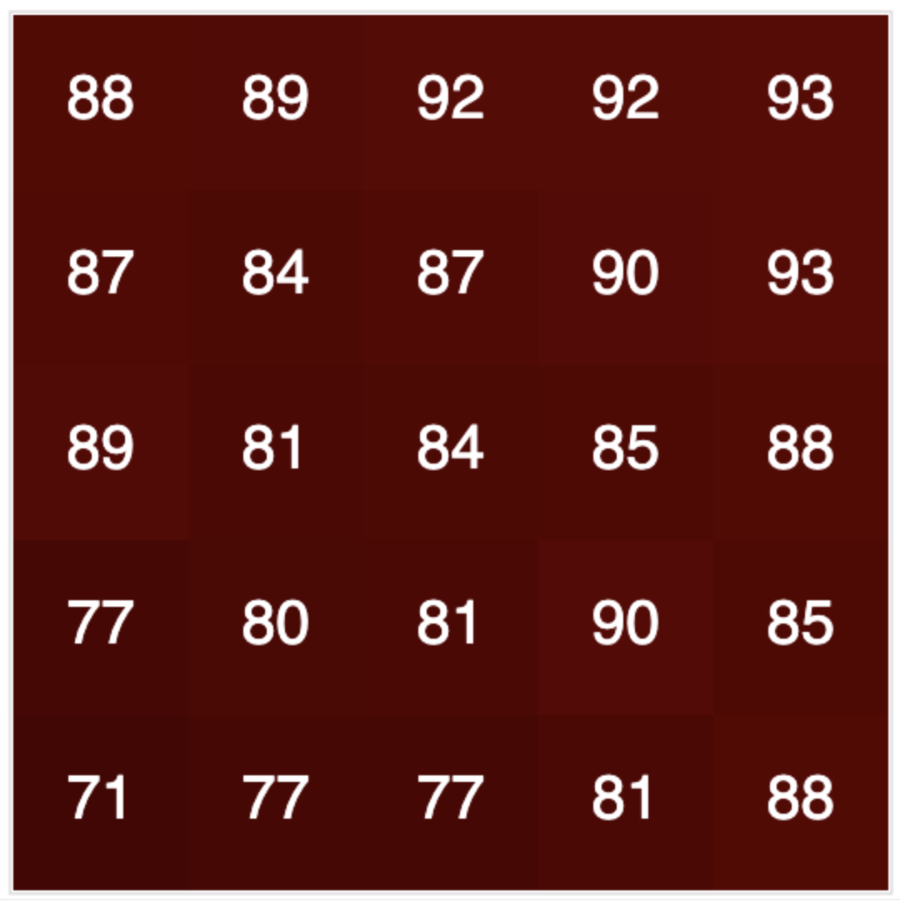

# Meaning RGB

In workshop #2, we learned how computers "see" color - through RBG values! But the buoy does more. Did you notice that there were lots of little pixels on the screen in the applet we used last time? Which one is best? The buoy takes all of the pixels for each test pad and calculates their mean, which results in a mean Red, mean Green, and mean Blue value for each pad.

:::{.columns}
:::{.column}

:::
::: {.column}
{width="90%"}
:::
:::


## RGB and Scatterplots

During this activity, we'll learn a bit more about linear regression and how the buoy can use regression to predict nitrate values.

:::{.gray-container}
**Materials Needed:**  
- [RGB Applet V2](https://appalachianaicorps.org/modules/water-quality/RGB-Applet-2.html){target="_blank"}  
- Deck of Purple "Nitrate Test Pad" Cards  
- Pencil  
- Highlighter (optional but helpful)  
- Handout  
- Dot Stickers  
- Large Graph Paper  
- Poster Markers  
:::
<br>

## RGB Activity (Part 1)
### Instructions
1. Open the [RGB Applet V2](https://appalachianaicorps.org/modules/water-quality/RGB-Applet-2.html){target="_blank"}.  
2. Find card #1 in your deck. Hold it 1 to 2 inches in front of your webcam. 
3. Using the middle square in the frame, record the RGB values for the card on your handout.  

4. Repeat this process for all other numbered cards in your deck.  Make sure you hold each card the same distance away from your webcam.


## Scatterplots Activity (Part 2)
### Instructions

```{=html}
<br>
<div style="position: relative; padding-bottom: 56.25%; height: 0; overflow: hidden; max-width: 100%;">
  <iframe 
    src="https://www.youtube.com/embed/b_Au4Ngm9pE?start=8&end=86" 
    frameborder="0" 
    allowfullscreen
    style="position: absolute; top: 0; left: 0; width: 100%; height: 100%; border: 0;">
  </iframe>
</div>
<br>
```

:::{.ltorange-container}
This portion of the activity will be completed with your group.<br>Each group will be assigned either to **red**, **green**, or **blue**.
:::

1. Using the round stickies and graph paper, create a scatterplot.  
2. Place the color values (either red, green or blue, depending on your group assignment) on the x-axis and the nitrate concentrations on the y-axis.  


