## Lesson Objective
<hr>
In this lesson, you will learn how to use scatterplots and regression lines in Python to predict nitrate levels from RGB color values on test strips.
<br>
<br>

:::{.gray-container}
**Materials Needed:**

- 💻 A computer with a webcam
- A web browser (Chrome, Firefox, or Safari)

:::

## Workshop Structure
<hr>

::: {.activity-text}
💻 **Navigate to:**<br><br><center> [**https://tinyurl.com/aaic-wq-3**](https://tinyurl.com/aaic-wq-3){target="_blank"}
</center><br>

:::

## Review
<hr>

:::{.gray-container .fourtyeightpt-font}
**Last workshop we learned:**

:::{.incremental}

- AI: Classification
  - Model Accuracy
- Agricultural Uses of Classification
- Data Ownership
- Computers & Color

:::
:::

# 🎨 Quick Catch Up: Computers & Color Activity

## RGB Values --> Color
<hr>

:::{.ltblue-container .thirtyfourpt-font}
🎯 **Checkpoint 7. a:** Using RGB Values to Create Color
:::

:::{.gray-container .thirtyfourpt-font}
**Materials Needed:**  

- 💻 Slider Tool on Pg. 0
- 📝 Handout from last workshop
:::

## Using RGB Values to Create Color
<hr>

:::{.activity-text .line-height .incremental}
- Use the slider tool below to convert the RGB values (from last workshop) to colors
- Record your answers on the handout
- We'll do one together!
:::

:::{.gray-container}

```{=html}
<div id="rgb-widgets-card" style="max-width:720px;margin:18px auto;font-family:system-ui, -apple-system, 'Segoe UI', Roboto, 'Helvetica Neue', Arial;">
  <h3 style="margin:0 0 8px 0;font-size:18px">Slide the R, G, or B to see how it affects the color of the square!</h3>

  <div style="display:flex;gap:18px;flex-wrap:wrap;align-items:flex-start">
    <div style="flex:1;min-width:260px;">
      <div style="display:flex;align-items:center;gap:8px;margin-bottom:8px">
        <div style="width:56px;font-weight:600;text-align:right">R:</div>
        <input id="rRange" type="range" min="0" max="255" step="1" value="128" aria-label="Red" style="flex:1">
        <div id="rVal" style="width:56px;text-align:center;font-family:monospace;font-weight:600;background:#f1f3f5;padding:6px 8px;border-radius:6px;border:1px solid #eee">128</div>
      </div>

      <div style="display:flex;align-items:center;gap:8px;margin-bottom:8px">
        <div style="width:56px;font-weight:600;text-align:right">G:</div>
        <input id="gRange" type="range" min="0" max="255" step="1" value="128" aria-label="Green" style="flex:1">
        <div id="gVal" style="width:56px;text-align:center;font-family:monospace;font-weight:600;background:#f1f3f5;padding:6px 8px;border-radius:6px;border:1px solid #eee">128</div>
      </div>

      <div style="display:flex;align-items:center;gap:8px;margin-bottom:8px">
        <div style="width:56px;font-weight:600;text-align:right">B:</div>
        <input id="bRange" type="range" min="0" max="255" step="1" value="128" aria-label="Blue" style="flex:1">
        <div id="bVal" style="width:56px;text-align:center;font-family:monospace;font-weight:600;background:#f1f3f5;padding:6px 8px;border-radius:6px;border:1px solid #eee">128</div>
      </div>
    </div>

    <div style="display:flex;flex-direction:column;gap:10px;align-items:center">
      <div id="colorPreview" role="img" aria-label="Color preview" style="width:200px;height:200px;border-radius:8px;border:1px solid #dcdcdc;background:rgb(128,128,128)"></div>
    </div>
  </div>
</div>

<script>
(function () {
  const clamp = (v, a=0, b=255) => Math.min(Math.max(Math.round(v), a), b);

  const rRange = document.getElementById('rRange');
  const gRange = document.getElementById('gRange');
  const bRange = document.getElementById('bRange');
  const rVal = document.getElementById('rVal');
  const gVal = document.getElementById('gVal');
  const bVal = document.getElementById('bVal');
  const colorPreview = document.getElementById('colorPreview');

  const state = {
    r: clamp(parseInt(rRange.value, 10)),
    g: clamp(parseInt(gRange.value, 10)),
    b: clamp(parseInt(bRange.value, 10))
  };

  window.latest_widget_values = { r: state.r, g: state.g, b: state.b };

  function updateFromInputs() {
    state.r = clamp(parseInt(rRange.value, 10));
    state.g = clamp(parseInt(gRange.value, 10));
    state.b = clamp(parseInt(bRange.value, 10));

    rVal.textContent = state.r;
    gVal.textContent = state.g;
    bVal.textContent = state.b;

    colorPreview.style.background = `rgb(${state.r}, ${state.g}, ${state.b})`;

    window.latest_widget_values.r = state.r;
    window.latest_widget_values.g = state.g;
    window.latest_widget_values.b = state.b;
  }

  [rRange, gRange, bRange].forEach(el => {
    el.addEventListener('input', updateFromInputs);
    el.addEventListener('change', updateFromInputs);
  });

  updateFromInputs();

  window.getLatestWidgetValues = () => ({...window.latest_widget_values});
})();
</script>
```

:::

## Using RGB Values to Create Color
<hr>

:::{.ltblue-container .thirtyfourpt-font}

🎯 **Checkpoint 7. b:** Use the slider tool!  
<br>
What color does this RGB value represent? (110, 164, 212)  
<br>
Just like the computer last workshop, try to classify/make a prediction about what fruit this could be!
:::

# Workshop #3

## Remember Me, Smokey Buoy!?
<hr>

We met Smokey Buoy last workshop and learned a bit about how it works.

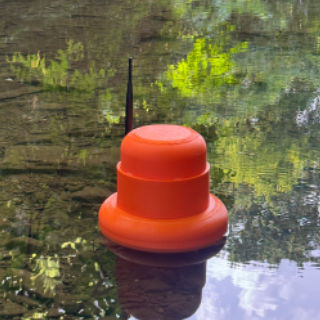{fig-align="center"}

## Smokey Buoy: Components
<hr>

Let's recall Smokey's components and how they work together

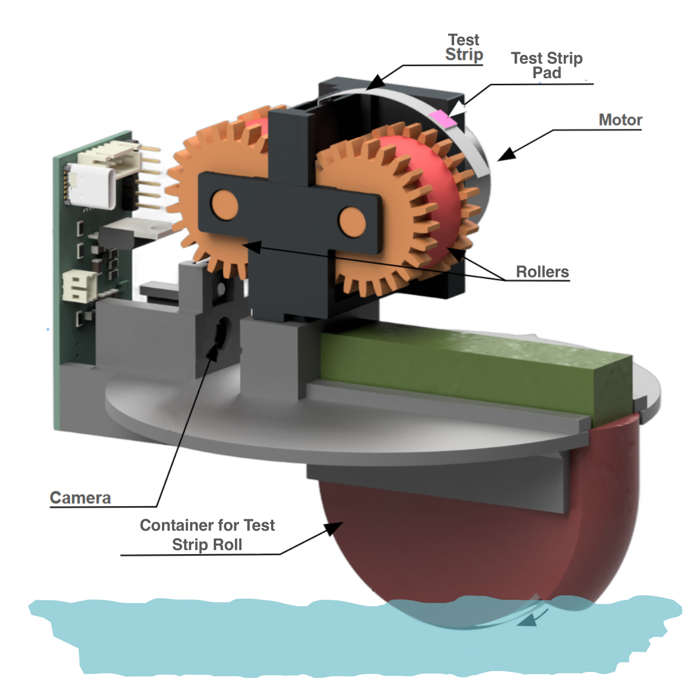{fig-align="center" width="60%"}

## Smokey Buoy: 🎥 Camera
<hr>

:::: {.columns}
::: {.column width="50%"}
Smokey Buoy's camera has two jobs:

:::{.incremental}
- **Watch for a test pad**
  - We talked about this last workshop!
  - *Recall:* What is the process called?
- **When pad is present, take a picture**
  - We'll discuss what happens with the picture today!
  - *A new process!*
:::
:::
::: {.column width="50%"}
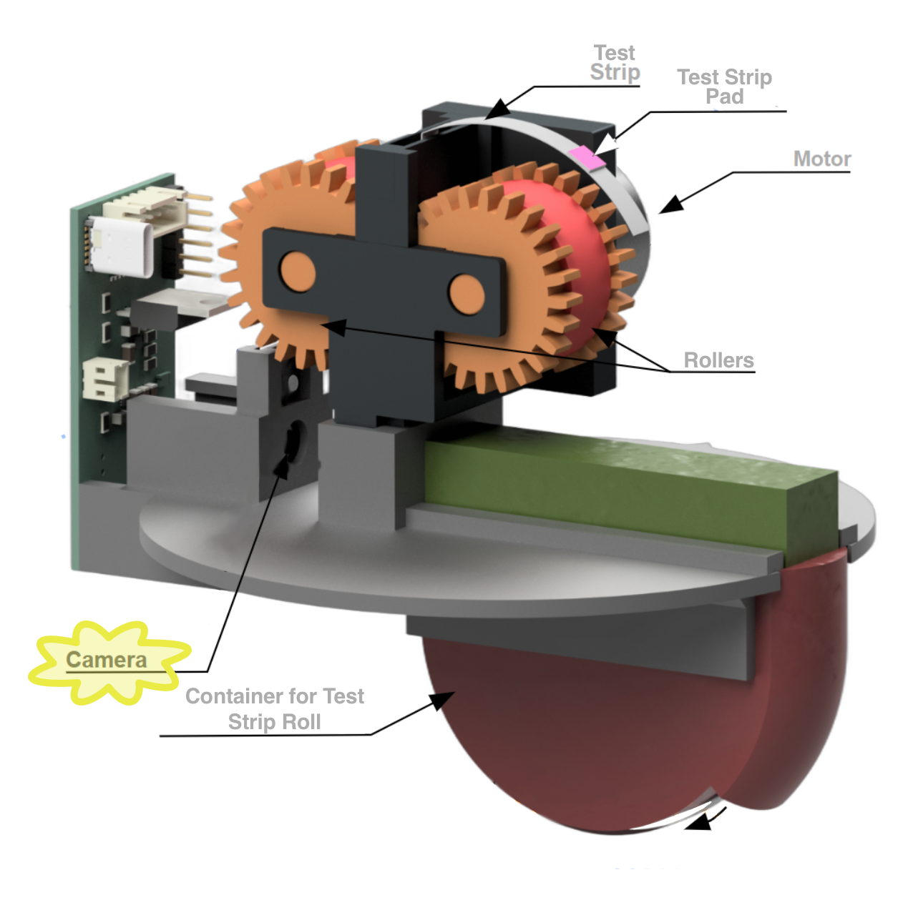{width=75%}
:::
::::

# Introduction to Regression

## Introduction to Regression
<hr>

:::{.fourtyeightpt-font .incremental}
- Last workshop, we learned about **classification**.
- In this workshop, we will learn about **regression**.
- Regression is all about **predicting** something (a number!) from something else (other numbers).
:::

## Scenario 1: Cube Towers
<hr>

:::{.activity-text}
- We want to build a tower
- We have 1" inch cubes to use
:::

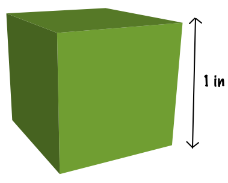{fig-align="center" width="35%"}

## 📝 Let's Predict! — 1 Cube
<hr>

:::: {.columns}
::: {.column width="40%"}
| # of Cubes | Height (inches) |
|:---:|:---:|
| 1 | 1 |
:::
::: {.column width="60%"}
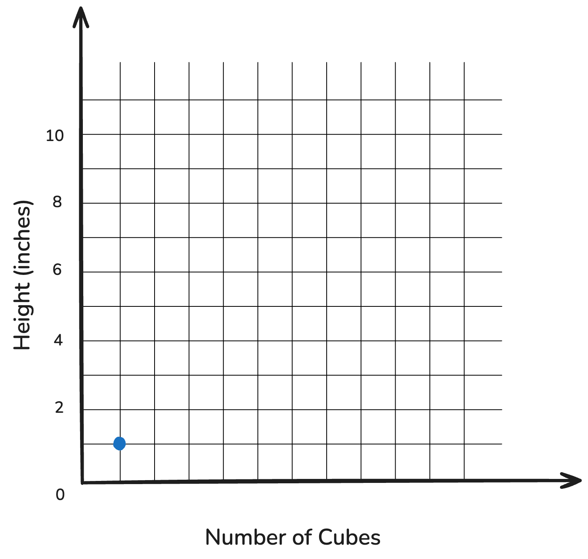{fig-align="center"}
:::
::::

## 📝 Let's Predict! — 2 Cubes
<hr>

:::: {.columns}
::: {.column width="40%"}
| # of Cubes | Height (inches) |
|:---:|:---:|
| 1 | 1 |
| 2 |
:::
::: {.column width="60%"}
{fig-align="center"}
:::
::::

## 📝 Let's Predict! — 2 Cubes
<hr>

:::: {.columns}
::: {.column width="40%"}
| # of Cubes | Height (inches) |
|:---:|:---:|
| 1 | 1 |
| 2 | 2 |
:::
::: {.column width="60%"}
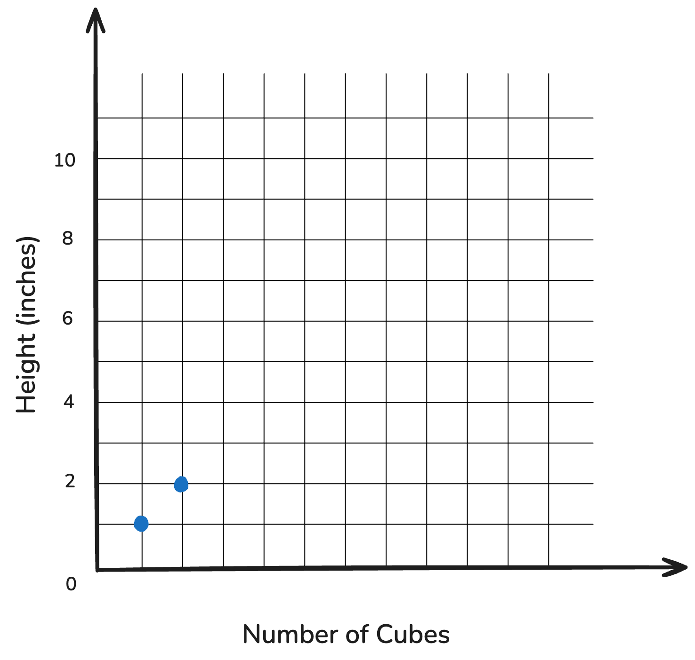{fig-align="center"}
:::
::::

## 📝 Let's Predict! — 3 Cubes
<hr>

:::: {.columns}
::: {.column width="40%"}
| # of Cubes | Height (inches) |
|:---:|:---:|
| 1 | 1 |
| 2 | 2 |
| 3 |
:::
::: {.column width="60%"}
{fig-align="center"}
:::
::::

## 📝 Let's Predict! — 3 Cubes
<hr>

:::: {.columns}
::: {.column width="40%"}
| # of Cubes | Height (inches) |
|:---:|:---:|
| 1 | 1 |
| 2 | 2 |
| 3 | 3 |
:::
::: {.column width="60%"}
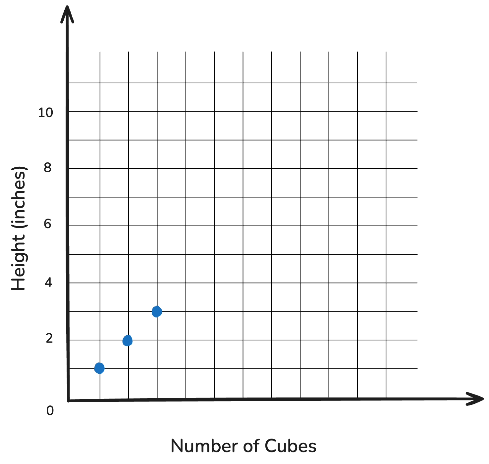{fig-align="center"}
:::
::::

## 📝 Let's Predict! — 4 Cubes
<hr>

:::: {.columns}
::: {.column width="40%"}
| # of Cubes | Height (inches) |
|:---:|:---:|
| 1 | 1 |
| 2 | 2 |
| 3 | 3 |
| 4 |
:::
::: {.column width="60%"}
{fig-align="center"}
:::
::::

## 📝 Let's Predict! — 4 Cubes
<hr>

:::: {.columns}
::: {.column width="40%"}
| # of Cubes | Height (inches) |
|:---:|:---:|
| 1 | 1 |
| 2 | 2 |
| 3 | 3 |
| 4 | 4 |
:::
::: {.column width="60%"}
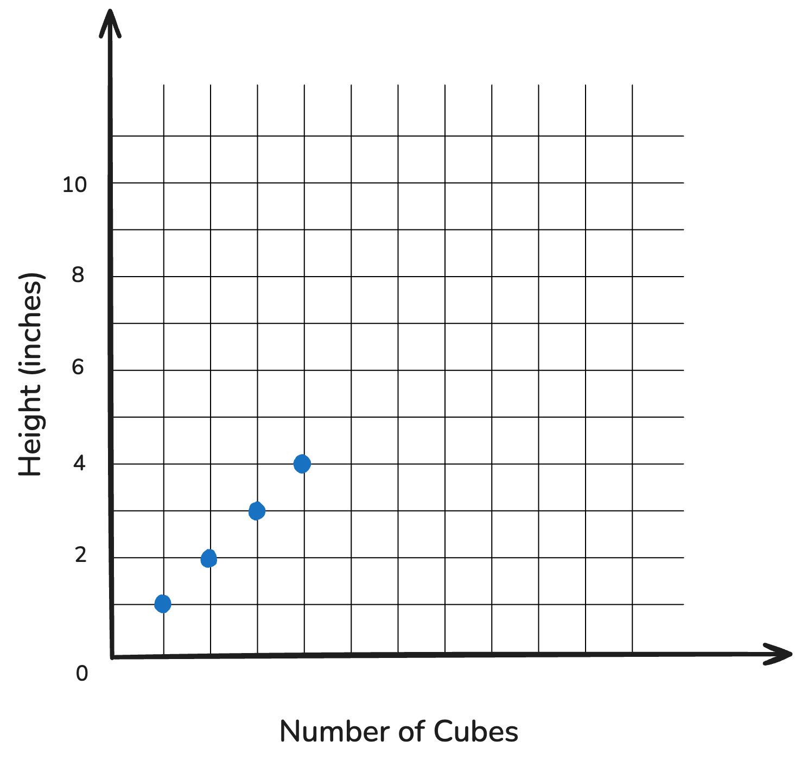{fig-align="center"}
:::
::::

## 📝 Let's Predict! — 5 Cubes
<hr>

:::: {.columns}
::: {.column width="40%"}
| # of Cubes | Height (inches) |
|:---:|:---:|
| 1 | 1 |
| 2 | 2 |
| 3 | 3 |
| 4 | 4 |
| 5 |
:::
::: {.column width="60%"}
{fig-align="center"}
:::
::::

## 📝 Let's Predict! — 5 Cubes
<hr>

:::: {.columns}
::: {.column width="40%"}
| # of Cubes | Height (inches) |
|:---:|:---:|
| 1 | 1 |
| 2 | 2 |
| 3 | 3 |
| 4 | 4 |
| 5 | 5 |
:::
::: {.column width="60%"}
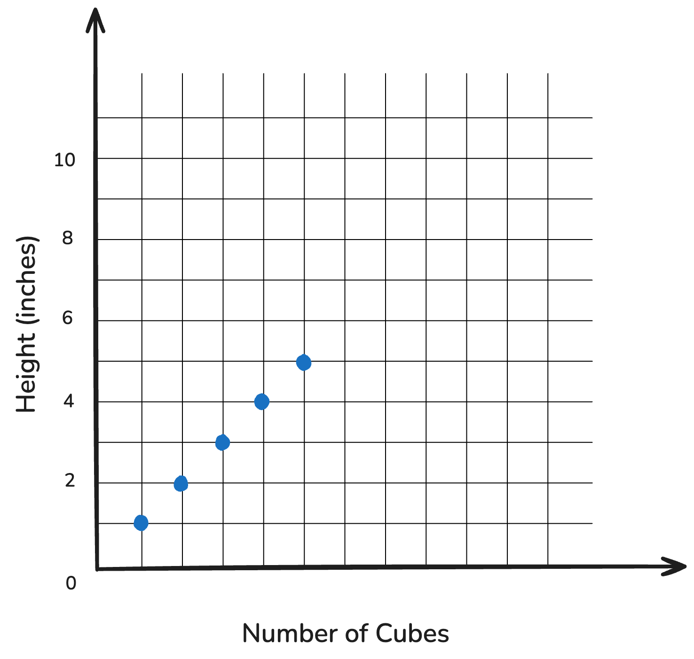{fig-align="center"}
:::
::::

## 📝 Let's Predict! — 10 Cubes
<hr>

:::: {.columns}
::: {.column width="40%"}
| # of Cubes | Height (inches) |
|:---:|:---:|
| 1 | 1 |
| 2 | 2 |
| 3 | 3 |
| 4 | 4 |
| 5 | 5 |
| 10 |
:::
::: {.column width="60%"}
{fig-align="center"}
:::
::::

## 📝 Let's Predict! — 10 Cubes
<hr>

:::: {.columns}
::: {.column width="40%"}
| # of Cubes | Height (inches) |
|:---:|:---:|
| 1 | 1 |
| 2 | 2 |
| 3 | 3 |
| 4 | 4 |
| 5 | 5 |
| 10 | 10 |
:::
::: {.column width="60%"}
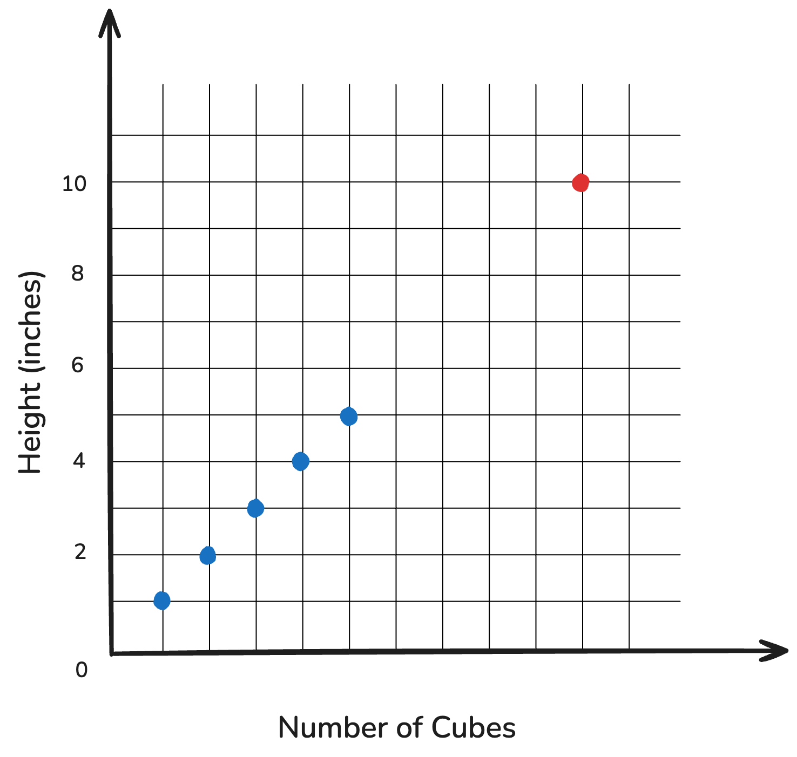{fig-align="center"}
:::
::::

## 🗣️ Discuss: In Your Group
<hr>

:::{.ltblue-container .thirtyfourpt-font}
🎯 **Checkpoint 2. a:**
<br><br>
[**Q1:** How tall will our tower be if we use **100 cubes**?]{.fragment}  
<br>
[**Q2:** Your friend argues that the tower will be 99 inches tall. What would you tell him? Why?]{.fragment}
:::

## Scenario 2: Cheap Uncle Bob
<hr>

:::{.fourtyeightpt-font .incremental}
- We want to build a much taller tower than our current 10" one, but we ran out of 1" cubes.
- 🎉 Uncle Bob volunteers to make us more cubes — cheaper!
:::

## Scenario 2: Cheap Uncle Bob
<hr>

Oh no! Uncle Bob's cubes are all slightly different heights!

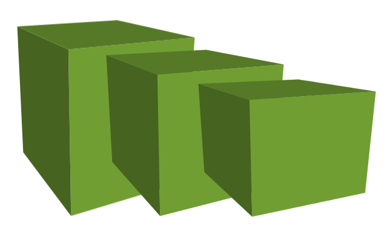{fig-align="center" width="35%"}

## 🗣️ Discuss: In Your Group
<hr>

:::{.ltblue-container .thirtyfourpt-font}
🎯 **Checkpoint 2. b:**
<br><br>
How will Uncle Bob's new cubes affect our tower height predictions?
:::

# The Case for Regression

## The Case for Regression
<hr>

:::: {.columns}
::: {.column}
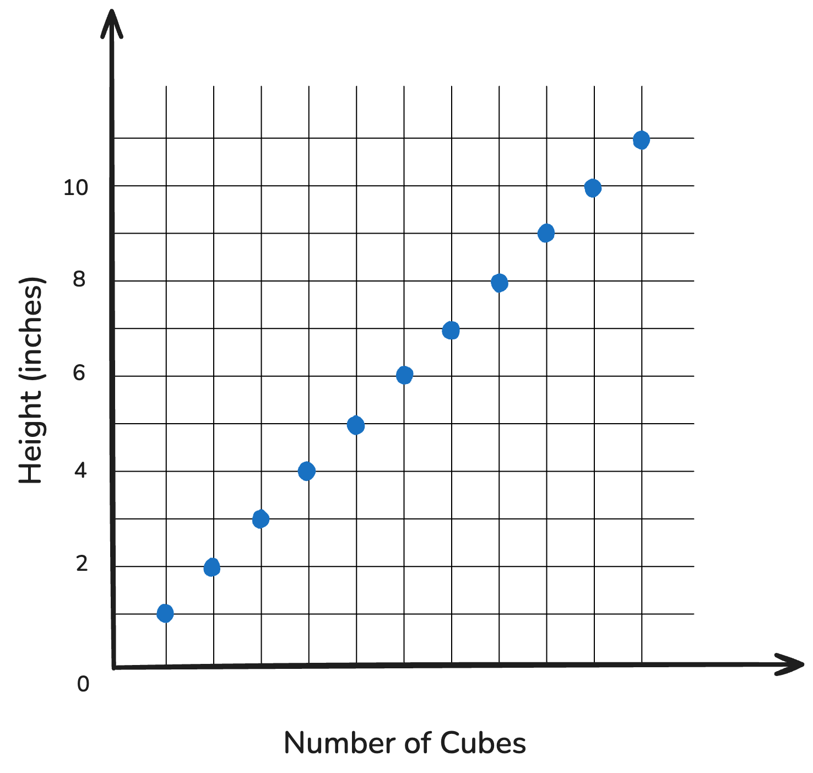{width=90%}
:::
::: {.activity-text .column}

:::
::::

## The Case for Regression
<hr>

:::: {.columns}
::: {.column}
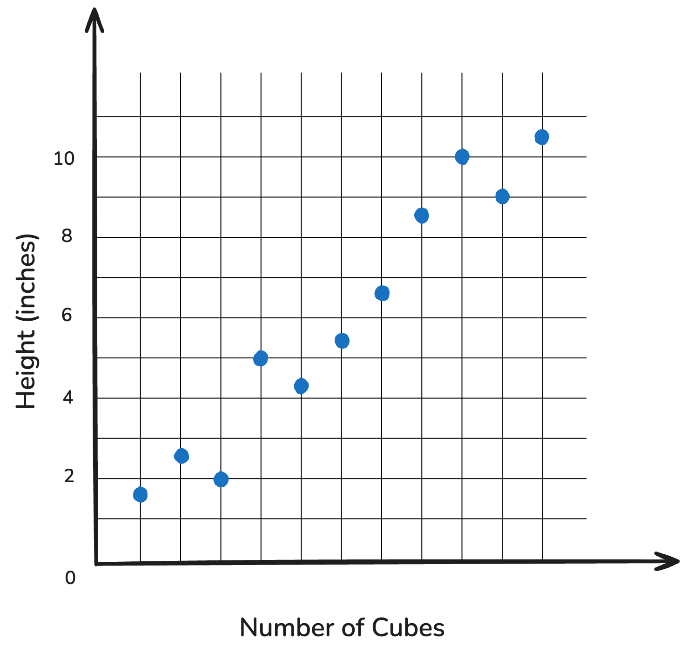{width=90%}
:::
::: {.activity-text .column}
Bob's cubes saved us money, but now tower heights are all over the place.  <br><br>
We need a better way to predict.
:::
::::

## How Do We Fit Our Line?
<hr>

:::: {.columns}
::: {.column}
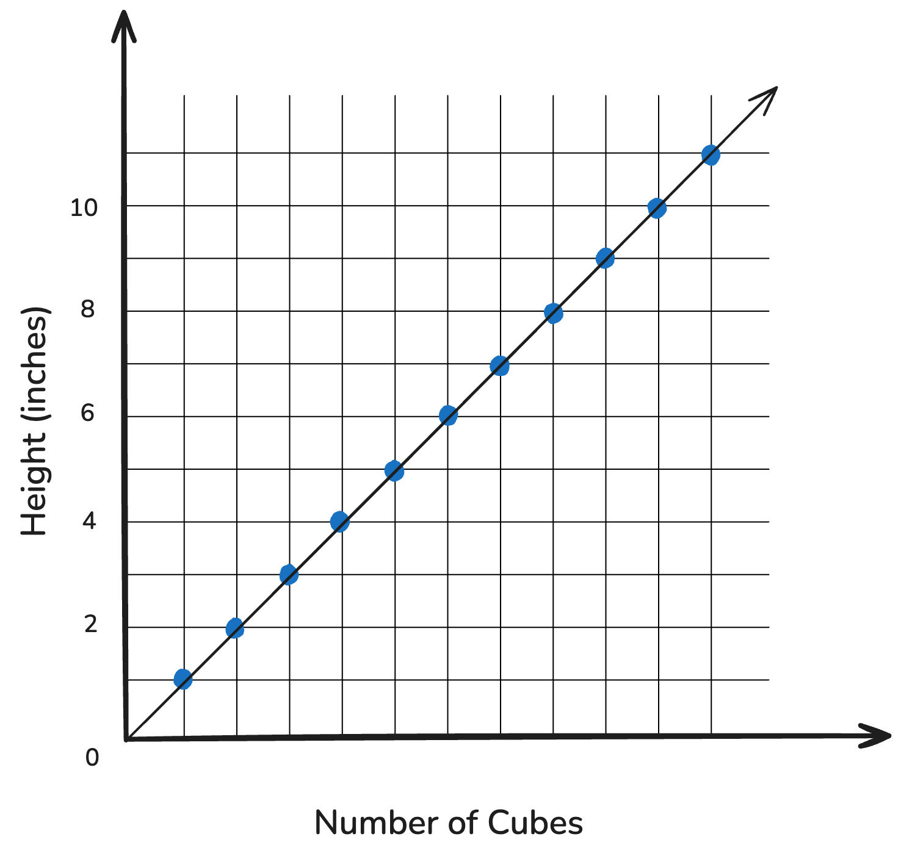
:::
::: {.column}
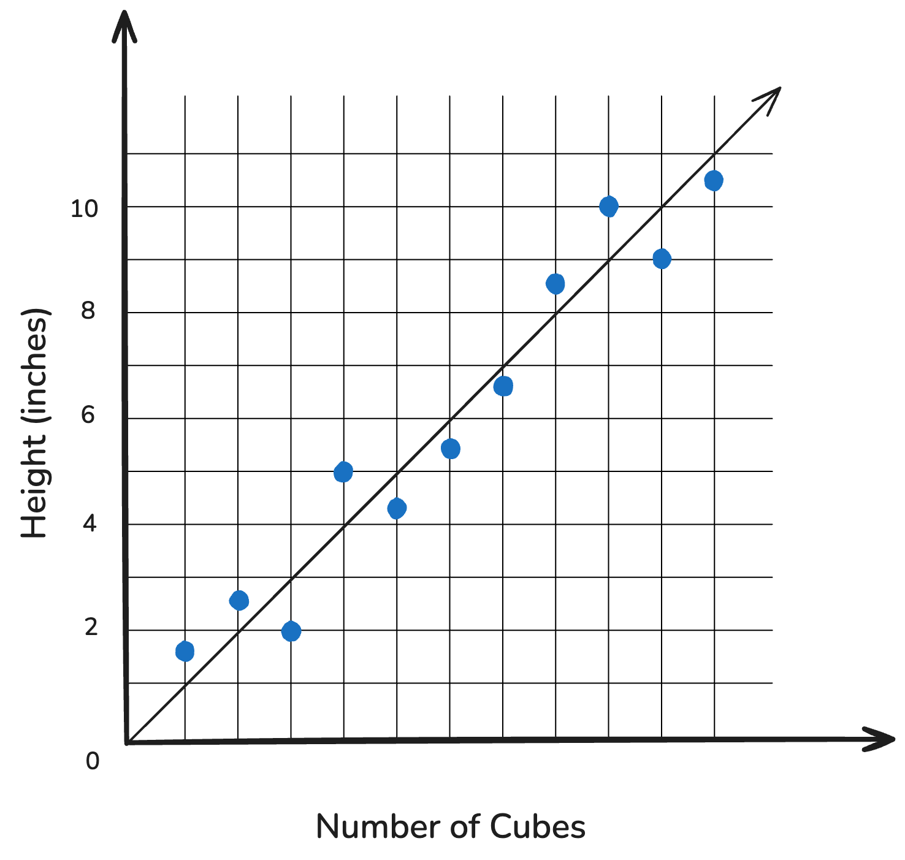
:::
::::

## Smokey Buoy: Regression
<hr>

:::{.fourtyeightpt-font .incremental}
- The buoy also uses **regression** to predict nitrate levels.
- Let's learn a bit more about this!
:::

# 🔬<br>Regression Activity — Pt. I:<br>RGB and Scatterplots

## Averaging RGB
<hr>

:::{.activity-text}
In Workshop #2, we learned how computers "see" color through RGB values. The buoy takes **all the pixels** for each test pad and finds their **mean**.
:::

:::: {.columns style="display:flex; align-items:center; justify-content:center;"}
::: {.column style="display:flex; justify-content:center;"}
{style="height:300px; width:auto; object-fit:contain;"}
:::
::: {.column style="display:flex; justify-content:center;"}

:::
::::

## Averaging RGB
<hr>

:::{.activity-text}
In Workshop #2, we learned how computers "see" color through RGB values. The buoy takes **all the pixels** for each test pad and finds their **mean**.
:::

:::: {.columns style="display:flex; align-items:center; justify-content:center;"}
::: {.column style="display:flex; justify-content:center;"}
{style="height:300px; width:auto; object-fit:contain;"}
:::
::: {.column style="display:flex; justify-content:center;"}
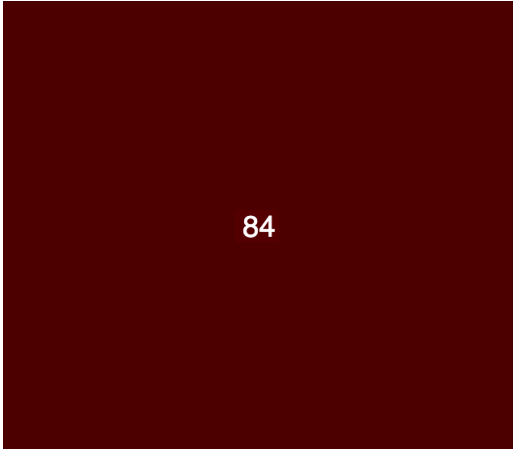{style="height:300px; width:auto; object-fit:contain;"}
:::
::::


## Averaging RGB
<hr>

:::{.activity-text}
In our applet (for the next activity), we split the pixels into a grid and meaned each section. We will treat the center box like the test pad (use that number).
:::

:::: {.columns style="display:flex; align-items:center; justify-content:center;"}
::: {.column style="display:flex; justify-content:center;"}
{style="height:300px; width:auto; object-fit:contain;"}
:::
::: {.column style="display:flex; justify-content:center;"}

:::
::: {.column style="display:flex; justify-content:center;"}

:::
::: {.column style="display:flex; justify-content:center;"}

:::
::::

## Averaging RGB
<hr>

:::{.activity-text}
In our applet (for the next activity), we split the pixels into a grid and meaned each section. We will treat the center box like the test pad (use that number).
:::

:::: {.columns style="display:flex; align-items:center; justify-content:center;"}
::: {.column style="display:flex; justify-content:center;"}
{style="height:300px; width:auto; object-fit:contain;"}
:::
::: {.column style="display:flex; justify-content:center;"}
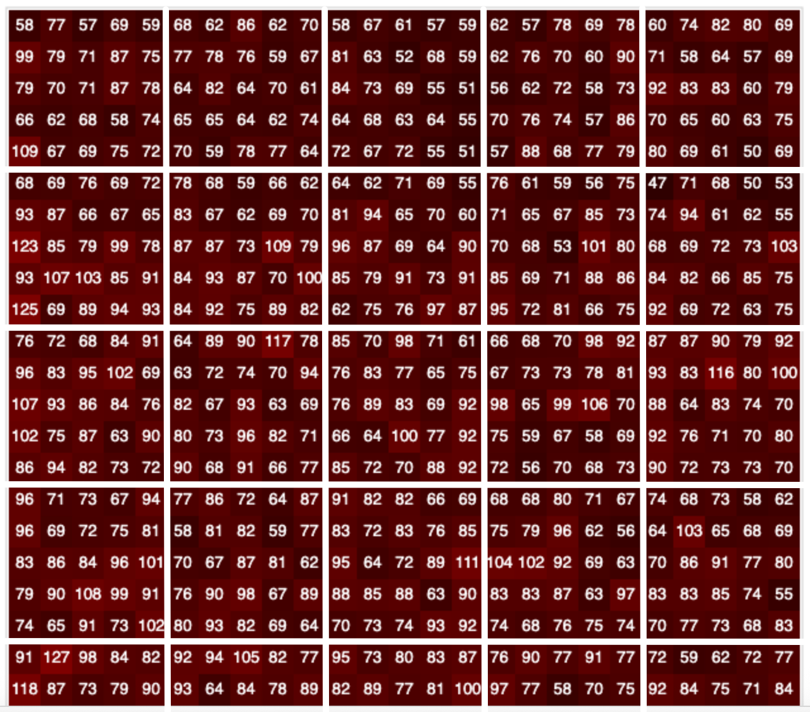{style="height:300px; width:auto; object-fit:contain;"}
:::
::: {.column style="display:flex; justify-content:center;"}

:::
::: {.column style="display:flex; justify-content:center;"}

:::
::::

## Averaging RGB
<hr>

:::{.activity-text}
In our applet (for the next activity), we split the pixels into a grid and meaned each section. We will treat the center box like the test pad (use that number).
:::

:::: {.columns style="display:flex; align-items:center; justify-content:center;"}
::: {.column style="display:flex; justify-content:center;"}
{style="height:300px; width:auto; object-fit:contain;"}
:::
::: {.column style="display:flex; justify-content:center;"}
{style="height:300px; width:auto; object-fit:contain;"}
:::
::: {.column style="display:flex; justify-content:center;"}
{style="height:300px; width:auto; object-fit:contain;"}
:::
::: {.column style="display:flex; justify-content:center;"}

:::
::::

## Averaging RGB
<hr>

:::{.activity-text}
In our applet (for the next activity), we split the pixels into a grid and meaned each section. We will treat the center box like the test pad (use that number).
:::

:::: {.columns style="display:flex; align-items:center; justify-content:center;"}
::: {.column style="display:flex; justify-content:center;"}
{style="height:300px; width:auto; object-fit:contain;"}
:::
::: {.column style="display:flex; justify-content:center;"}
{style="height:300px; width:auto; object-fit:contain;"}
:::
::: {.column style="display:flex; justify-content:center;"}
{style="height:300px; width:auto; object-fit:contain;"}
:::
::: {.column style="display:flex; justify-content:center;"}
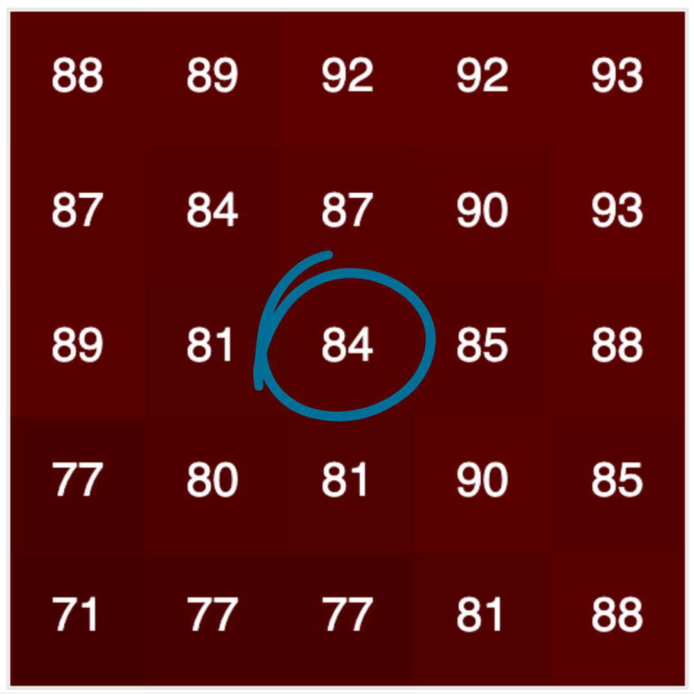{style="height:300px; width:auto; object-fit:contain;"}
:::
::::

# 👨🏽‍🤝‍👨🏿👩🏼‍🤝‍👨🏾👩🏼‍🤝‍👩🏻<br>Groupwork!

## RGB Activity (Pt. I)
<hr>

:::{.gray-container .fourtyeightpt-font}
**Materials Needed:**

- 💻 [RGB Applet V2](https://appalachianaicorps.org/modules/water-quality/RGB-Applet-2.html){target="_blank"}
- Deck of Purple "Nitrate Test Pad" Cards
- Pencil / Highlighter (optional)
- Handout / Dot Stickers
- Large Graph Paper / Poster Markers
:::

## RGB Activity (Pt. I)
<hr>

### Roles

:::{.activity-text}
- *Human Buoy* (1 person): Needs the nitrate test cards and computer handy
- *Data Recorders* (2+ people): Need handout and pencil
:::

## RGB Activity (Pt. I) — Instructions
<hr>

:::{.fourtyeightpt-font}
1. **HB:** Open the [RGB Applet V2](https://appalachianaicorps.org/modules/water-quality/RGB-Applet-2.html){target="_blank"} in a new tab.
2. **HB:** Find card #1 in your deck and hold it in front of your webcam.
3. **DRs:** Using the middle square in the frame, record the RGB values on your handout.
4. Repeat for all other cards in deck.
:::

## RGB Activity (Pt. I) — Instructions
<hr>

:::{.fourtyeightpt-font}
5. When finished, make sure all group members have the data values recorded on their handouts.
:::

# Activity Pt. II <br> Scatterplots!

## Activity (Pt. II) - Scatterplots
<hr>

```{=html}
<center>
<div style="position: relative; padding-bottom: 56.25%; height: 0; overflow: hidden; max-width: 100%;">
  <iframe 
    src="https://www.youtube.com/embed/b_Au4Ngm9pE?start=8&end=86" 
    frameborder="0" 
    allowfullscreen
    style="position: absolute; top: 0; left: 0; width: 100%; height: 100%; border: 0;">
  </iframe>
</div>
</center>
```

## Activity (Pt. II) — Instructions
<hr>

:::{.ltorange-container .fourtyeightpt-font}
For this portion, each group is assigned either **red**, **green**, or **blue**, based on the color of your stickers!
:::
<br>

## Activity (Pt. II) — Instructions
<hr>

:::{.fourtyeightpt-font}
1. Using the round stickies and graph paper, create a scatterplot.
2. Color values (R, G, or B — per your group) go on the **x-axis**.
3. Nitrate concentrations go on the **y-axis**.
:::

# 💻 Activity — Pt. III:<br>Regression Modeling

## Regression Modeling
<hr>

```{=html}
<center>
<div style="position: relative; padding-bottom: 56.25%; height: 0; overflow: hidden; max-width: 100%;">
  <iframe 
    src="https://www.youtube.com/embed/e18KM681cmg?start=8&end=74" 
    frameborder="0" 
    allowfullscreen
    style="position: absolute; top: 0; left: 0; width: 100%; height: 100%; border: 0;">
  </iframe>
</div>
</center>
```

```{python}
#| echo: false
import numpy as np
import pandas as pd
import matplotlib.pyplot as plt
import json
import warnings
from IPython.display import display, HTML

def process_data(color_data, nitrate_ppm):
    color_data = np.array(color_data)
    nitrate_ppm = np.array(nitrate_ppm)
    return color_data, nitrate_ppm

def process_df(color_data, nitrate_ppm):
    df = pd.DataFrame({
        "color_data": color_data,
        "nitrate_ppm": nitrate_ppm
    })
    return df

def linear_regression(x, y):
    slope, intercept = np.polyfit(x, y, 1)
    return slope, intercept

def calculate_rsquared(x, y, slope, intercept):
    y_pred = slope * x + intercept
    ss_res = np.sum((y - y_pred) ** 2)
    ss_tot = np.sum((y - np.mean(y)) ** 2)
    return 1 - (ss_res / ss_tot)

def show_prediction_plot(color_data, nitrate_ppm, slope, intercept):
    x_arr = np.linspace(float(min(color_data)), float(max(color_data)), 200)
    y_arr = (slope * x_arr + intercept).tolist()
    x_arr = x_arr.tolist()
    x0 = float(min(color_data))
    y0 = float(slope * x0 + intercept)
    srcdoc = f"""<!DOCTYPE html>
<html>
<head>
<script src="https://cdn.plot.ly/plotly-latest.min.js"></script>
<style>
body {{ font-family: sans-serif; margin: 10px; }}
.row {{ display: flex; align-items: center; gap: 12px; margin-bottom: 8px; }}
#lbl {{ font-size: 15px; color: navy; font-weight: bold; }}
</style>
</head>
<body>
<div class="row">
  <b>Color value:</b>
  <input type="number" id="inp" value="{x0:.0f}" step="1"
         style="font-size:15px;width:90px;padding:5px 8px;border:2px solid #ccc;border-radius:4px;"
         oninput="upd()">
  <span id="lbl"></span>
</div>
<div id="plt"></div>
<script>
var m={slope}, b={intercept};
var t1={{x:{json.dumps(color_data.tolist())},y:{json.dumps(nitrate_ppm.tolist())},mode:"markers",name:"Your Data",marker:{{color:"black",size:9}}}};
var t2={{x:{json.dumps(x_arr)},y:{json.dumps(y_arr)},mode:"lines",name:"Regression Line",line:{{color:"tomato",width:2.5}},hoverinfo:"skip"}};
var t3={{x:[{x0}],y:[{y0:.4f}],mode:"markers+text",name:"Prediction",marker:{{color:"dodgerblue",size:14,line:{{color:"white",width:2}}}},text:["({x0:.1f}, {y0:.2f} ppm)"],textposition:"top right",textfont:{{size:13,color:"navy"}}}};
Plotly.newPlot("plt",[t1,t2,t3],{{title:"Type a color value to see the predicted nitrate!",xaxis:{{title:"Color Value"}},yaxis:{{title:"Nitrate (ppm)"}},height:430,hovermode:"closest"}});
function upd(){{
  var x=parseFloat(document.getElementById("inp").value);
  if(isNaN(x))return;
  var y=m*x+b;
  document.getElementById("lbl").textContent="Ordered pair: ("+x.toFixed(1)+", "+y.toFixed(2)+" ppm)";
  Plotly.restyle("plt",{{x:[[x]],y:[[y]],text:[["("+x.toFixed(1)+", "+y.toFixed(2)+" ppm)"]]}}, [2]);
}}
upd();
</script>
</body>
</html>"""

    with warnings.catch_warnings():
        warnings.simplefilter("ignore", UserWarning)
        display(HTML(
            '<iframe srcdoc="{}" width="100%" height="510" '
            'frameborder="0" style="border:none;"></iframe>'.format(
                srcdoc.replace('"', '&quot;')
            )
        ))
```

## Storing Your Data
<hr>

:::{.dkorange-container .twentyeightpt-font}
Replace the `??` placeholders with your color values and nitrate concentrations.

**IMPORTANT:** Values must be in the **exact same order**.

Click ▶️ **Run Code** to store your data.
:::

```python
color_data = [??, ??, ??, ??, ??, ??, ??, ??]
nitrate_ppm = [??, ??, ??, ??, ??, ??, ??, ??]

print(color_data)
print(nitrate_ppm)

color_data, nitrate_ppm = process_data(color_data, nitrate_ppm)
df = process_df(color_data, nitrate_ppm)
```

## Storing Your Data
<hr>

:::{.dkorange-container .twentyeightpt-font}
Replace the `??` placeholders with your color values and nitrate concentrations.

**IMPORTANT:** Values must be in the **exact same order**.

Click ▶️ **Run Code** to store your data.
:::

```{python}
color_data = [188, 179, 176, 176, 172, 167, 166, 162]
nitrate_ppm = [0, 1, 2, 3, 4, 5, 6, 7]

print(color_data)
print(nitrate_ppm)

color_data, nitrate_ppm = process_data(color_data, nitrate_ppm)
df = process_df(color_data, nitrate_ppm)
```

## Recreating Your Team's Scatterplot
<hr>

:::{.dkorange-container .thirtyfourpt-font}
Replace the `??` placeholders:

- First blank → x variable: `color_data`
- Second blank → y variable: `nitrate_ppm`

Click ▶️ **Run Code** to create a scatterplot matching your group's paper plot.
:::

```python
plt.figure(figsize=(6, 5))
plt.scatter(df["??"], df["??"], s=60, color="black")
plt.title("Nitrate vs. Color")
plt.xlabel("Color")
plt.ylabel("Nitrate (ppm)")
plt.tight_layout()
plt.show()
```
## Recreating Your Team's Scatterplot
<hr>

:::{.dkorange-container .thirtyfourpt-font}
Replace the `??` placeholders:

- First blank → x variable: `color_data`
- Second blank → y variable: `nitrate_ppm`

Click ▶️ **Run Code** to create a scatterplot matching your group's paper plot.
:::

```python
plt.figure(figsize=(6, 5))
plt.scatter(df["color_data"], df["nitrate_ppm"], s=60, color="black")
plt.title("Nitrate vs. Color")
plt.xlabel("Color")
plt.ylabel("Nitrate (ppm)")
plt.tight_layout()
plt.show()
```

## Recreating Your Team's Scatterplot
<hr>

```{python}
#| echo: false
plt.figure(figsize=(6, 5))
plt.scatter(df["color_data"], df["nitrate_ppm"], s=60, color="black")
plt.title("Nitrate vs. Color")
plt.xlabel("Color")
plt.ylabel("Nitrate (ppm)")
plt.tight_layout()
plt.show()
```

## 🗣️Discussion: Placing the Line of Best Fit
<hr>
:::{.gray-container .twentyeightpt-font}
**Materials Needed:** Complete Scatterplot, Yardstick
:::

:::{.ltblue-container .thirtyfourpt-font}
🎯 **Checkpoint 5. a:**
<br><br>
With your group, discuss where your regression line will likely fall on your scatterplot. Once your group has made a decision, place your yardstick on top of your scatterplot as if it's the line.

**Note:** Lines will likely vary across groups, given that you are working with different color channels!
:::


## Running the Linear Regression
<hr>

:::{.dkorange-container .thirtyfourpt-font}
Replace the `??` placeholders:

- First blank → x variable: `color_data`
- Second blank → y variable: `nitrate_ppm`

Click ▶️ **Run Code** to generate the line of best fit equation.
:::

```python
slope, intercept = linear_regression(??, ??)

print("slope (m):", slope)
print("intercept (b):", intercept)
```

## Running the Linear Regression
<hr>

:::{.dkorange-container .thirtyfourpt-font}
Replace the `??` placeholders:

- First blank → x variable: `color_data`
- Second blank → y variable: `nitrate_ppm`

Click ▶️ **Run Code** to generate the line of best fit equation.
:::

```{python}
slope, intercept = linear_regression(color_data, nitrate_ppm)

print("slope (m):", slope)
print("intercept (b):", intercept)
```

## From Regression to Equation
<hr>

:::{.activity-text}
The linear regression produces the equation for the **line of best fit**.  <br>
:::

:::{.fourtyeightpt-font}
Remember ***y = mx + b***? We can just substitute!
:::

:::{.dkorange-container .thirtyfourpt-font}
Click ▶️ **Run Code** to see the slope-intercept equation.
:::

```python
print(f"y = {slope:.2f}x + {intercept:.2f}")
```

## From Regression to Equation
<hr>

:::{.activity-text}
The linear regression produces the equation for the **line of best fit**.  <br>
:::

:::{.fourtyeightpt-font}
Remember ***y = mx + b***? We can just substitute!
:::

:::{.dkorange-container .thirtyfourpt-font}
Click ▶️ **Run Code** to see the slope-intercept equation.
:::

```{python}
print(f"y = {slope:.2f}x + {intercept:.2f}")
```

## Plotting the Regression Line
<hr>

:::{.dkorange-container .twentyeightpt-font}
Click ▶️ **Run Code** to plot the scatterplot with the regression line.
:::

```python
nitrate_pred = slope * color_data + intercept

plt.figure(figsize=(6, 5))
plt.scatter(color_data, nitrate_ppm, s=60, color="black")
plt.plot(color_data, nitrate_pred, color="black", linewidth=1)
plt.title("Nitrate Concentration vs. Color")
plt.xlabel("Color")
plt.ylabel("Nitrate Concentration (ppm)")
plt.text(
    min(color_data), max(nitrate_ppm),
    f"y = {slope:.2f}x + {intercept:.2f}\n",
    ha="left", fontsize=10, color="gray"
)
plt.tight_layout()
plt.show()
```

## Plotting the Regression Line
<hr>

```{python}
#| echo: false
nitrate_pred = slope * color_data + intercept

plt.figure(figsize=(6, 5))
plt.scatter(color_data, nitrate_ppm, s=60, color="black")
plt.plot(color_data, nitrate_pred, color="black", linewidth=1)
plt.title("Nitrate Concentration vs. Color")
plt.xlabel("Color")
plt.ylabel("Nitrate Concentration (ppm)")
plt.text(
    min(color_data), max(nitrate_ppm),
    f"y = {slope:.2f}x + {intercept:.2f}\n",
    ha="left", fontsize=10, color="gray"
)
plt.tight_layout()
plt.show()
```

## Activity Pt. IV — Draw Line of Best Fit
<hr>

:::{.gray-container .fourtyeightpt-font}
**Materials Needed:**

- Poster Markers
- Completed Scatterplot
- Yardstick
:::

## Activity Pt. IV — Draw Line of Best Fit
<hr>

:::{.activity-text}
Using the exact positioning Python generated, **copy the regression line onto your group's scatterplot**. When finished, bring your group's plot to the front of the class.
:::

# 🔮 Prediction & R²

## Making Predictions — Reload Your Data
<hr>

:::{.dkorange-container .thirtyfourpt-font}
Re-enter your color values and nitrate concentrations.

**NOTE:** You can copy/paste the two lists from the previous activity.

Click ▶️ **Run Code** to re-load your data.
:::

```{python}
color_data = [188, 179, 176, 176, 172, 167, 166, 162]
nitrate_ppm = [0, 1, 2, 3, 4, 5, 6, 7]

# Do not change the code below ------------------------------------
color_data, nitrate_ppm = process_data(color_data, nitrate_ppm)
slope, intercept = linear_regression(color_data, nitrate_ppm)
print(f"Slope: {slope:.2f}, Intercept: {intercept:.2f}")
```

## Using the Model to Predict
<hr>

:::{.activity-text}
Now that we have our regression model, we can **predict** nitrate concentrations for new color values — even ones we didn't measure!
:::

:::{.dkorange-container .thirtyfourpt-font}
Click ▶️ **Run Code**, then type any color value into the box to see the predicted nitrate concentration.
:::

```python
show_prediction_plot(color_data, nitrate_ppm, slope, intercept)
```

## Using the Model to Predict
<hr>

```{python}
#| echo: false
show_prediction_plot(color_data, nitrate_ppm, slope, intercept)
```

## Activity Pt. V: Predict New Concentrations
<hr>

:::{.gray-container .fourtyeightpt-font}
**Materials Needed:**

- 💻 [RGB Applet V2](https://appalachianaicorps.org/modules/water-quality/RGB-Applet-2.html){target="_blank"}
- Three Additional "Nitrate Test Pad" Cards
- Handout / Pencil
:::

## Activity Pt. V: Predict New Concentrations
<hr>

:::{.fourtyeightpt-font}
1. Use the applet to find the R, G, or B value for the new cards (per your group).
2. Use the graphing tool to **predict the nitrate concentration (ppm)**.
3. Record these predictions on your handout.
:::

## 🗣️ Share Out: What Are Your Model Predictions?
<hr>
| Sample # | Red Model | Green Model| Blue Model |
|:---:|:---:|:---:|:---:|
| Sample 1 |  |  |  |
| Sample 2 |  |  |  |
| Sample 3 |  |  |  |

## 🗣️ Share Out: What Are Your Model Predictions?
<hr>
| Sample # | Red Model | Green Model| Blue Model |
|:---:|:---:|:---:|:---:|
| Sample 1 |  |  |  |
| Sample 2 |  |  |  |
| Sample 3 |  |  |  |

::: {.callout-important}
## Consider
Wouldn't it be great if there was a number to tell us how good our models/predictions are?
:::

# Understanding R²

## How Good Is Our Model? R²
<hr>

:::{.activity-text}
**R²** (R-squared) tells us how well our regression line fits the data — like a report card:
:::

| R² value | What it means |
|----------|---------------|
| Close to **100%** | Line fits very well — predictions will be accurate |
| Around **70–90%** | A reasonably strong fit |
| Close to **0%** | Line barely fits — predictions won't be reliable |

## Calculate Your R² Value
<hr>

:::{.dkorange-container .thirtyfourpt-font}
Click ▶️ **Run Code** to calculate your model's R² value.
:::

```python
r_squared = calculate_rsquared(color_data, nitrate_ppm, slope, intercept)

print(f"R² = {r_squared * 100:.1f}%")
```

## Calculate Your R² Value
<hr>

:::{.dkorange-container .thirtyfourpt-font}
Click ▶️ **Run Code** to calculate your model's R² value.
:::

```{python}
r_squared = calculate_rsquared(color_data, nitrate_ppm, slope, intercept)

print(f"R² = {r_squared * 100:.1f}%")
```

## 🗣️ Discuss: In Your Group
<hr>

:::{.ltblue-container .thirtyfourpt-font}
🎯 **Checkpoint 6. a:**
<br><br>
Write your group's R² value on the poster at the front of the room.

Compare with the other groups — what do you notice?
<br><br>
**How might we improve our model and, therefore, our predictions?**
:::

## 🗣️ Discuss: In Your Group
<hr>

:::{.gray-container .twentyeightpt-font}
**Materials Needed:** Handout, Pencil
:::

:::{.ltblue-container .thirtyfourpt-font}
🎯 **Checkpoint 6. b:** ***Stop and Jot***
<br><br>
**Scenario:** A local strawberry farm sells berries at small stands around town. They want to sell out every day! Some days are slower than others, so they're thinking about offering discounts to sell more. What makes a day slow or busy? What clues could help them predict when to offer a discount?
:::

# 🎟️<br>Exit Ticket

## 🎟️ Exit Ticket
<hr>
<br>
<br>
<br>

:::{.thirtyfourpt-font .activity-text style="text-align: center;"}
🎉 Great job! You've learned so much!

Share what you've learned on the [**Exit Ticket**](https://forms.gle/3FKgkkyLxZrqoFnf7).
:::

# 🧠<br>Exercises

## 🧠  Exercises
<hr>
<br>
<br>
<br>

:::{.thirtyfourpt-font .activity-text style="text-align: center;"}
Want to practice what we've learned?

Try the **Exercises**.
:::